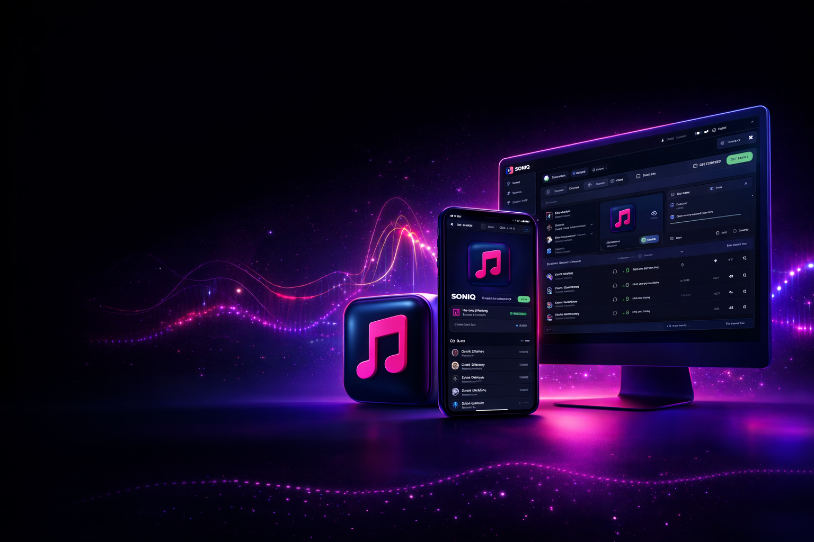
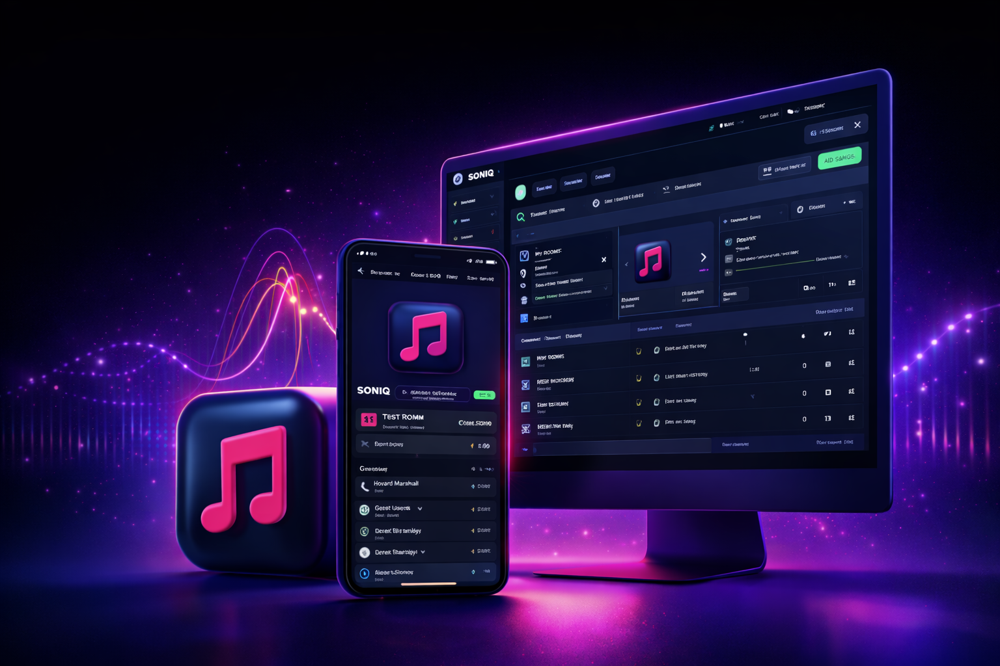

# SONIQ - Premium Real-time Social Music Streaming

[](https://opensource.org/licenses/MIT)
[](https://nextjs.org/)
[](https://www.typescriptlang.org/)
[](https://socket.io/)

Experience premium real-time social music streaming with SONIQ. Listen together, vibe together.

SONIQ lets you listen to YouTube music together in real time — perfectly synced, no delays, no awkward “play now?” moments. Create or join rooms, manage queues, chat live, and assign roles like Admin, DJ, or Moderator to control the vibe.



## ✨ Features

- 🎵 **Perfect Sync**: Listen to YouTube tracks in perfect synchronization across all members.
- 🏠 **Live Rooms**: Create public or private rooms with unique invite codes.
- 💬 **Live Chat**: Real-time messaging with emoji support and typing indicators.
- 🎭 **Role Management**: Assign roles such as Host, DJ, and Moderator.
- 🎼 **Queue Control**: Advanced queue management (Add, Remove, Reorder, Shuffle, Repeat).
- 🔊 **Permission Logic**: Fine-grained controls for who can play/pause, skip, or add to queue.
- 🎨 **Premium UI**: Glassmorphism design with smooth animations and dark mode.

## 🚀 Tech Stack

### Frontend
- **Framework**: [Next.js 15](https://nextjs.org/) (App Router)
- **Styling**: [Tailwind CSS](https://tailwindcss.com/) + [Shadcn/UI](https://ui.shadcn.com/)
- **Animations**: [Framer Motion](https://www.framer.com/motion/)
- **State Management**: [Zustand](https://github.com/pmndrs/zustand)
- **Real-time**: [Socket.io Client](https://socket.io/docs/v4/client-api/)

### Backend
- **Runtime**: [Node.js](https://nodejs.org/)
- **Framework**: [Express.js](https://expressjs.com/)
- **Database**: [MongoDB](https://www.mongodb.com/) (Mongoose ORM)
- **Real-time**: [Socket.io](https://socket.io/)
- **Caching**: [Redis](https://redis.io/) (Optional, for scaling)

## 📸 Screenshots

| Home Dashboard | Explore Rooms |
| :---: | :---: |
|  |  |

| Room View | Mobile Preview |
| :---: | :---: |
|  |  |

*(Note: High-resolution screenshots can be found in the `docs/screenshots` directory)*

## 🛠️ Getting Started

### Prerequisites
- Node.js (v18+)
- MongoDB (Running locally or via Atlas)
- Redis (Optional, for production scaling)

### 1. Clone the repository
```bash
git clone https://github.com/your-username/soniq.git
cd soniq
```

### 2. Backend Setup
```bash
cd backend
npm install
# Configure your .env file
npm run dev
```

### 3. Frontend Setup
```bash
cd ../frontend
pnpm install
# Configure your .env file
pnpm dev
```

## 🏗️ Project Structure

```bash
soniq/
├── backend/            # Express server & Socket handlers
│   ├── src/
│   │   ├── controllers/# API endpoint logic
│   │   ├── models/     # database schemas
│   │   ├── routes/     # API route definitions
│   │   └── socket/     # Real-time event handlers
├── frontend/           # Next.js web application
│   ├── src/
│   │   ├── app/        # Pages & Routes
│   │   ├── components/ # Reusable UI components
│   │   └── store/      # Zustand state management
└── docs/               # Project documentation & assets
```

## 📄 Documentation

Detailed documentation for each service can be found in their respective directories:
- [Backend Documentation](backend/README.md)
- [Frontend Documentation](frontend/README.md)

## 🤝 Contributing

We’d love your feedback — what features would you like to see next? Feel free to open an issue or submit a pull request.

## 📄 License

This project is licensed under the MIT License - see the [LICENSE](LICENSE) file for details.
